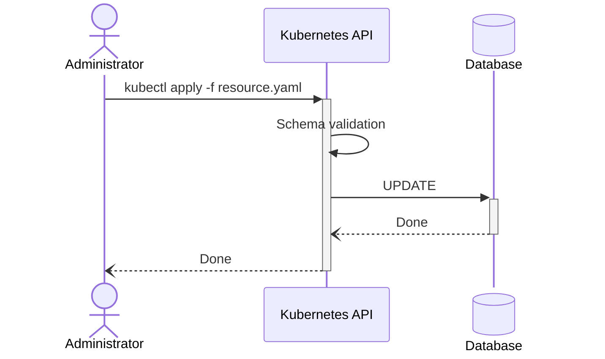
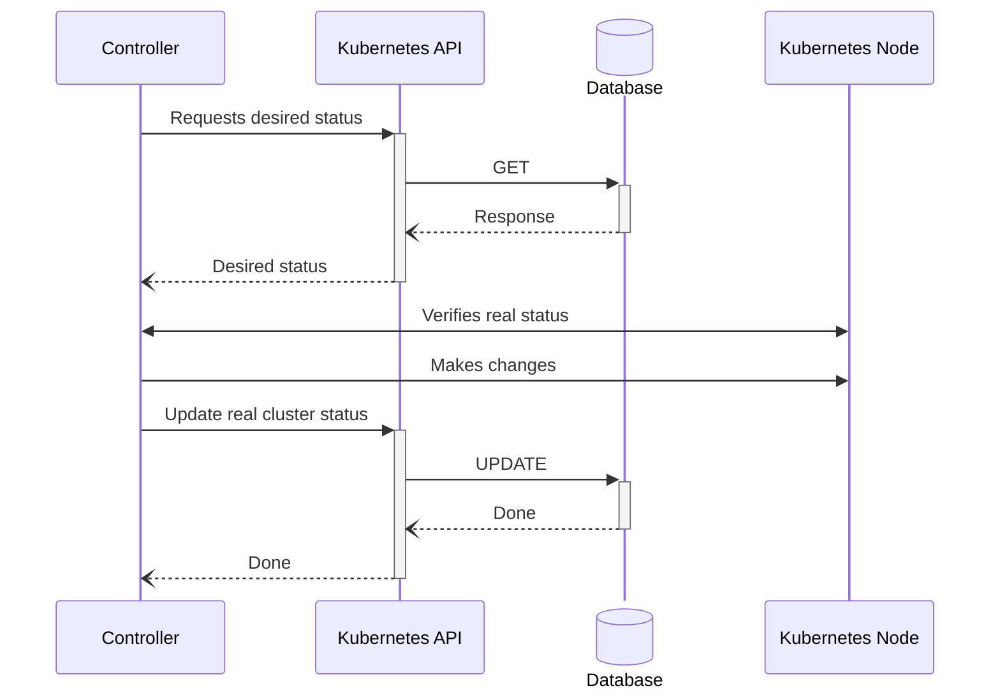

# Kubernetes Workshop

## All you need to start with kubernetes

Roberto Bochet &lt;avrdudo@poul.org&gt;

<div @click="$slidev.nav.next" class="mt-12 py-1" hover:bg="white op-10">
  Press Space for next page <carbon:arrow-right />
</div>

<div class="abs-br m-6 text-xl">
    <a href="https://github.com/RobertoBochet/kubernetes-workshop-slides" target="_blank" class="slidev-icon-btn">
        <carbon:logo-github />
    </a>
</div>

---

# What is Kubernetes?

---

# Why should you use Kubernetes?

---

# How can I **safely** test Kubernetes?

<v-click>

## [Minikube](https://minikube.sigs.k8s.io/docs/)

...sets up a **development** cluster directly on your machine using **containers**, or **VMs**

</v-click>

<v-click>

```shell
minikube start --nodes 3
```

It will deploy a kubernetes cluster composed of 3 nodes

</v-click>

---
layout: two-cols-header
---

<div class="text-center">

## Imperative vs Declarative

</div>

<br/>

::left::

<p v-click="1">I specify a task to be executed</p>

<i v-click="3">e.g., "Clean the room!"</i>

<p v-click="5">You have to perform the required task,
and once completed,
it's no longer your responsibility</p>

<div v-click="7" class="grid grid-cols-2 gap-4 pt-10 px-20 text-center">
    <div>
        
        <p>Ansible</p>
    </div>
    <div>
        
        <p class="text-center">Podman</p>
    </div>
</div>

::right::

<p v-click="2">I declare a desired state</p>

<i v-click="4">e.g., "The room must be clean"</i>

<p v-click="6">You have to maintain the desired state until a new state is declared</p>

<div v-click="8" class="grid grid-cols-2 gap-4 pt-10 px-20 text-center">
    <div>
        
        <p>OpenTofu<br/><small>(Terraform)</small></p>
    </div>
    <div>
        
        <p class="text-center">Kubernetes</p>
    </div>
</div>

---
layout: center
class: text-center
---

## Administrator requests cluster change

<br/>



---
layout: center
class: text-center
---

## Operator updates cluster status according to desired one

<br/>



---
layout: center
class: text-center
---

# Learn More

[Documentation](https://sli.dev) · [GitHub](https://github.com/slidevjs/slidev) · [Showcases](https://sli.dev/resources/showcases)

<PoweredBySlidev mt-10 />
